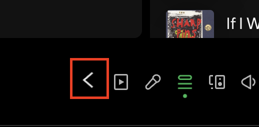

# Context History

This extension gives you a history for your playing context. A context is the song that's playing, where it's playing from, and the 'next up' queue.

Use this back button to restore previous context. Currently, the history length is set to 3.



## Manual Installation

```
npm run build-and-copy && spicetify apply
```

## Debugging

`printContextHistory()` and `clearContextHistory()` methods are available globally in the console.

## Made with Spicetify Creator

-   https://github.com/spicetify/spicetify-creator
